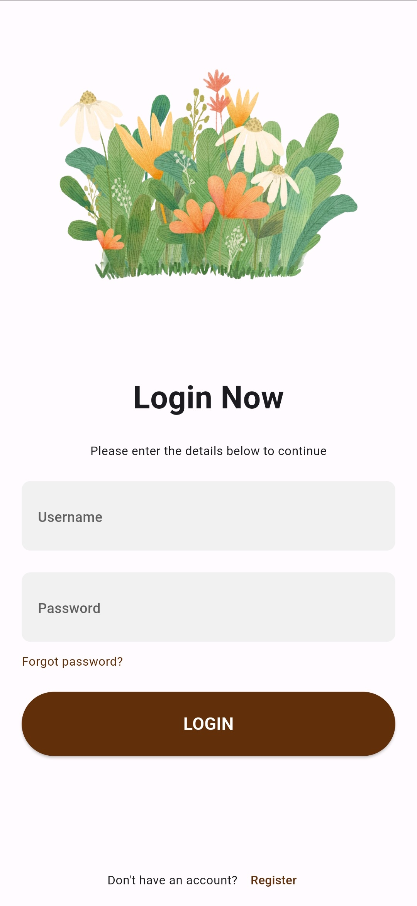

<h3 align="center">Habity</h3>

  

    Track your daily tasks and habits
     
    <a href="https://github.com/SharleneNdinda/habity-api/tree/master/docs"><strong>Explore the docs »</strong></a>
     
     
    <a href="https://github.com/SharleneNdinda/habity-frontend/issues">Report Bug</a>
    ·
    <a href="https://github.com/SharleneNdinda/habity-frontend/issues">Request Feature</a>
  

 

## 🤎 Welcome Screens

  
  

## 🤎 Auth Screens

  
  

